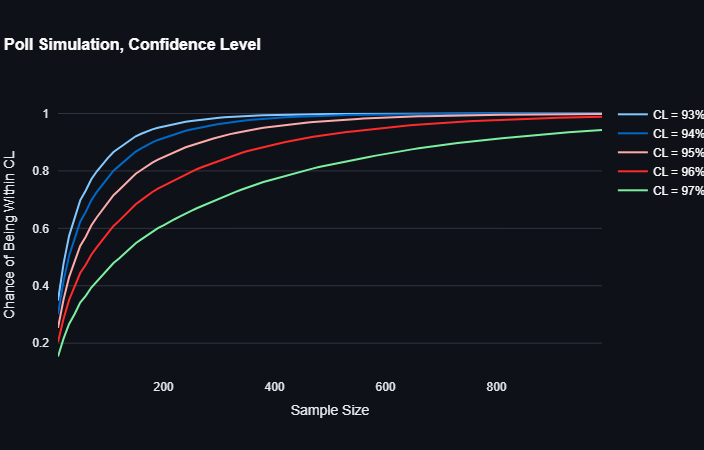

# Poll Simulation Dashboard
You can access the dashboard [here](https://hamidabbasi-r-poll-simulation-poll-simulation-2dalas.streamlit.app/). This repository contains a Streamlit-based dashboard that simulates poll results based on user-defined parameters. The aim is to predict the number of 1s in the population based on a poll results with a given sample size. The simulation demonstrates how sample size affects the accuracy of poll results, confidence intervals, and statistical significance.

## Overview

The dashboard allows users to simulate a poll by specifying:
- **True Percentage of 1 Among Population ($P_{true}$)**: The actual proportion of the population with a specific characteristic. This value is unknown in real-world scenarios.
- **Max Sample Size**: The maximum number of individuals to sample.
- **Confidence Level ($CL$)**: The desired confidence level for the confidence interval.
- **Random Seed**: A seed value for reproducibility of random sampling.

The dashboard generates three interactive graphs:
1. **Sample Mean and Confidence Interval**: Visualizes the sample mean and its confidence interval as the sample size increases.
2. **Confidence Level Probability**: Shows the probability that the sample mean falls within the specified confidence level of the true percentage.
3. **P-Value Analysis**: Displays the p-value for testing the null hypothesis ($P_{true} = 0.5$) and indicates whether the null hypothesis can be rejected.

## Key Features

### 1. Sample Mean and Confidence Interval
- **Sample Mean**: Calculated as:
  $$
  \bar{X} = \frac{1}{n} \sum_{i=1}^{n} x_i
  $$
- **Confidence Interval**:
  $$
  CI = \bar{X} \pm 1.96 \times SE
  $$
  where $SE$ (Standard Error) is:
  $$
  SE = \sqrt{\frac{\bar{X} \times (1 - \bar{X})}{n}}
  $$

### 2. Confidence Level Probability
- The probability that the sample mean is within the confidence level of the true percentage:
  $$
  P(\left|\bar{X} - P_{true}\right| < 1-CL)
  $$
  Simplified to:
  $$
  P((1-CL) / SE(\bar{X})) - P(-(1-CL) / SE(\bar{X}))
  $$

### 3. P-Value Analysis
- Tests the null hypothesis ($P_{true} = 0.5$) using:
  $$
  \text{p-value} = 2 \times \left(1 - \Phi\left(\left|\frac{\bar{X} - 0.5}{SE(\bar{X})}\right|\right)\right)
  $$
  If the p-value is less than 0.05, the null hypothesis is rejected.

## How to Use

1. Clone this repository:
   ```bash
   git clone https://github.com/HamidAbbasi-R/Poll-Simulation.git
   ```
2. Install the required dependencies:
   ```bash
   pip install streamlit numpy scipy plotly
   ```
3. Run the Streamlit app:
   ```bash
   streamlit run Poll_simulation.py
   ```
4. Adjust the parameters in the sidebar and observe the changes in the graphs.

## Graphs

### 1. Sample Mean and Confidence Interval


### 2. Confidence Level Probability


### 3. P-Value Analysis


## Dependencies

- `streamlit`: For building the interactive dashboard.
- `numpy`: For numerical computations.
- `scipy.stats`: For statistical functions like the cumulative distribution function (CDF).
- `plotly`: For creating interactive visualizations.

## Contributing

Contributions are welcome! Please feel free to submit a pull request or open an issue for any improvements or bug fixes.